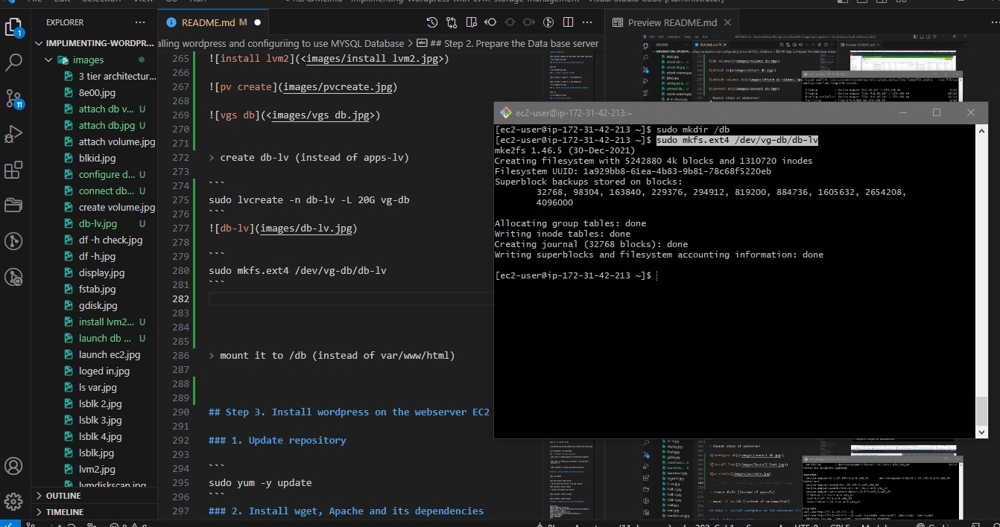

# Implimenting-Wordpress-with-LVM-storage-management - Armstrong

## Implimenting Wordpress website with LVM storage management

Three-tier Architecture


> The three layers are :
    1. The presentation layer which is the user interface.
    2. The business layer which is the backend.
    3. The data layer which is the computer data storage.

## Step 1. Prepare a web server


### 1. Launch instance and Create 3 volumes

> Launch an ec2 instance that will serve as a web server


> EBS means Elastic Bolck Volume

> Create 3 volumes , 10Gb each.


> 

### 2. Attach all three volumes the web server Ec2 instance


### 3. Open up the Linux terminal to begin configuration


### 4. Use lsblk

```
lsblk
```


### 5. Use df -h
> to see all mount devices

```
df -h
```

### 6. Use gdisk
> to create single partition on each of the 3 disks
```
gdisk
```


```
sudo gdisk /dev/xvdf
```


### 7. use lsblk to view the newly configured partition

```
lsblk
```


### 8. Install lvm2

```
sudo yum install lvm2 -y
```

```
sudo lvmdiskscan
```


> Run pvcreate to mark each of the three diska as physical volumes.

```
sudo pvcreate /dev/xvdf1
```
```
sudo pvcreate /dev/xvdg1
```
```
sudo pvcreate /dev/xvdh1
```


### 9. Verify that your physical volume has been created successfully.

```
sudo pvs
```


### 10. Use vcreateto add all three PV to a volume grounp named VG webdata-vg

```
sudo vgcreate webdata-vg /dev/xvdh1 /dev/xvdg1 /dev/xvdf1
```


### Verify that the VG was creared successlly

```
sudo vgs
```


### 11. Create 2 logicall volumes

```
sudo lvcreate -n apps-lv -L 14G webdata-vg
```
```
sudo lvcreate -n logs-lv -L 14G webdata-vg
```


### 12. Verify the logical volume has been created.

```
sudo lvs
```


### 13. Verify entire settup

```
sudo vgdisplay -v #view complete setup - VG, PV, and LV
```


```
sudo lsblk 
```


### 14. use mkfs.ext4 to format the logical volumes with ext4 filesystem

```
sudo mkfs -t ext4 /dev/webdata-vg/apps-lv
```
```
sudo mkfs -t ext4 /dev/webdata-vg/logs-lv
```


### 15. Create /var/www/html directory to store web files

```
sudo mkdir -p /var/www/html
```


### 16. Create to store backup of log data

```
sudo mkdir -p /home/recovery/logs
```

### 17. Mount /var/www/html on apps-lv logical volume

```
sudo mount /dev/webdata-vg/apps-lv /var/www/html/
```


### 18. Use rsync utility to backup all the files in the log directory /var/log into home/directory/logs

> this is required before mounting the file systems

```
sudo rsync -av /var/log/. /home/recovery/logs/
```


### 19. Mount /var/log on logs-lv logical volume

```
sudo mount /dev/webdata-vg/logs-lv /var/log
```


### 20. Restore files back into /var/log directory

```
sudo rsync -av /home/recovery/logs/log/. /var/log
```


### 21. Update file /etc/fstab so that the mount configuration will persist after restart of the server.

```
sudo blkid
```
```
sudo vi /etc/fstab
```
```
UUID=0134cdfc-Ocfd-4018-8b2e-bdf6802e91c0   /var/www/html  ext4  defaults  0 0
UUID=eb227b42-1387-4813-a2c4-77cf95bc7c68   /var/log       ext4  defaults  0 0
```


### 22. Test the configuration and reload the daemon

```
sudo mount -a
```
```
sudo systemctl daemon-reload
```


### 23. Verify the setup by running df -h

```
df -h
```


# Installing wordpress and configuriing to use MYSQL Database

## Step 2. Prepare the Data base server

> Launch a second redhat EC2 instance that will have a role -DB server


> Repeat steps of webserver


> create db-lv (instead of apps-lv)

```
sudo lvcreate -n db-lv -L 20G vg-db
```


```
sudo mkfs.ext4 /dev/vg-db/db-lv
```



> mount it to /db (instead of var/www/html)

```
sudo mount /dev/vg-db/db-lv /db
```


```
sudo blkid
```


```
sudo vi /etc/fstab
```


```
sudo mount -a
```
```
sudo systemctl daemon-reload
```


## Step 3. Install wordpress on the webserver EC2

```
sudo yum update -y
```

### 1. Update repository

```
sudo yum -y update
```


### 2. Install wget, Apache and its dependencies

```
sudo yum -y install wget httpd php php-mysqlnd php-fpm php-json 
```
 


### 3. Start Apache

```
sudo systemctl enable httpd
```
```
sudo systemctl start httpd
```


### 4. Install Apache and its dependencies

```
sudo yum install https://dl.fedoraproject.org/pub/epel/epel-release-latest-8.noarch.rpm
```
```
sudo yum install yum-utils http://rpms.remirepo.net/enterprise/remi-release-8.rpm
```
```
sudo yum module list php
```


```
sudo yum module reset php
```
```
sudo yum module enable php:remi-7.4
```
```
sudo yum install php php-opcache php-gd php-curl php-mysqlnd
```


```
sudo systemctl start php-fpm
```
```
sudo systemctl enable php-fpm
```
```
sudo systemctl status php-fpm
```


```
sudo setsebool -P httpd_execmem 1
```


### 5. Restart Apache

```
sudo systemctl restart httpd
```
### 6. Download wordpress and copy to var/www/html/

```
mkdir wordpress
```
```
cd   wordpress
```
```
sudo wget http://wordpress.org/latest.tar.gz
```


```
sudo tar xzvf latest.tar.gz
```


```
sudo rm -rf latest.tar.gz
```
```
sudo cp -R wp-config-sample.php wp-config.php
```


```
# cp wordpress/wp-config-sample.php wordpress/wp-config.php
```
```
sudo cp -R wordpress/. /var/www/html/
```


### 7. Configure SE linux policies
```
 sudo chown -R apache:apache /var/www/html/wordpress
 ```
 ```
 sudo chcon -t httpd_sys_rw_content_t /var/www/html/wordpress -R
 ```
 ```
 sudo setsebool -P httpd_can_network_connect=1
```

## Step 4. Install MySQl on the DB server EC2

```
sudo yum update
```
```
sudo yum install mysql-server
```


> restart and enable the service

```
sudo systemctl restart mysqld
```
```
sudo systemctl enable mysqld
```

> verify that the service is up and running
```
sudo systemctl status mysqld
```


## Step 5. Configure DB to work with wordpress

```
sudo mysql_secure_installation
```


```
sudo mysql -u root -p
```


```
sudo mysql
CREATE DATABASE wordpress;
CREATE USER `myuser`@`172.31.47.114` IDENTIFIED BY 'mypass';
GRANT ALL ON wordpress.* TO 'myuser'@'172.31.47.114';
FLUSH PRIVILEGES;
SHOW DATABASES;
exit
```

```
create database wordpress;
```
```
show databases
```


```
CREATE USER 'armstrong'@'172.31.47.114' IDENTIFIED WITH mysql_native_password BY 'happy';
```
```
GRANT ALL PRIVILEGES ON *.* TO 'armstrong'@'172.31.47.114' WITH GRANT OPTION;
```
```
FLUSH PRIVILEGES;
```
```
SHOW DATABASES;
```
```
select user, host from mysql.user;
```
```
exit
```


```
sudo vi /etc/my.cnf
```
```
[mysqld]
bind-address=0.0.0.0
```

```
[mysqld]
bind-address=172.31.47.114
```


```
sudo systemctl restart mysqld
```
> error encountered 
```
sudo systemctl stop mysqld
sudo yum remove mysql-server
sudo rm -rf /var/lib/mysql
sudo rm -rf /etc/my.cnf
sudo yum autoremove
rpm -qa | grep mysql
sudo userdel mysql
sudo groupdel mysql
sudo reboot
```


> edit sudo wp-config.php file in web server

```
sudo vi wp-config.php
```


```
sudo systemctl restart httpd
```
> disable the default page of apache

```
sudo mv /etc/httpd/conf.d/welcome.conf /etc/httpd/conf.d/welcome.conf_backup
```


## Step 6. Configure wordpress to connet to remote database

> open Mysql port 3306 on DB server EC2

> in the inbound rule configure source as /32


> install mysql client and test that you can connect from your webserver to the Data Base server EC2

```
sudo mysql -h 172.31.42.213 -u myuser -p
```


## Step 7. Configure SE Linux policies

```
 sudo chown -R apache:apache /var/www/html/
 ```
 ```
 sudo chcon -t httpd_sys_rw_content_t /var/www/html/ -R
 ```
 ```
 sudo setsebool -P httpd_can_network_connect=1
```


```
sudo yum install mysql
```
```
sudo mysql -u admin -p -h <DB-Server-Private-IP-address>
```
> verify you can execute SHOW DATABSES;

> change permissions and configurations so Apache could use wordpress.

> enable TCP port 80 in inbound rules configuration for Web server

> try to access from your browser link to the wordpress

```
http://<web-server-public-ip-address>/wordpress/
```


> fill out the DB credentials


# SUCCESS

# CONGRATULATIONS


